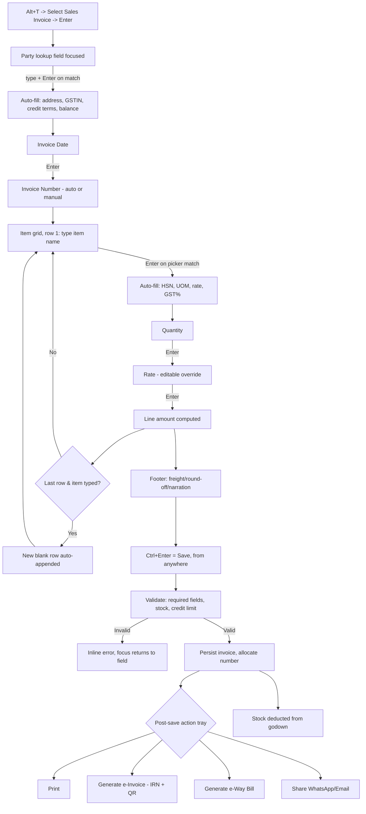

# Keyboard-Driven Invoice/Quote/E-Way Bill System
### Analysis of Miracle ERP workflow + reference implementation for a SaaS clone

> **Source note:** This document is based on Miracle's publicly published
> shortcut list, user guide, and marketing pages — not proprietary source
> code or a live license. e-Invoice and e-Way Bill field structures are
> government-mandated (GST IRP / NIC schemas), so those sections are
> authoritative for *any* ERP, not just Miracle. Verify exact menu paths and
> key bindings against your own installed version before treating them as a
> hard spec, since vendors revise these between releases.

---

## Table of Contents
1. [Shortcut keys reference](#1-shortcut-keys-reference)
2. [Step-by-step: creating a Sales Invoice](#2-step-by-step-creating-a-sales-invoice)
3. [Flow diagram](#3-flow-diagram)
4. [Field reference](#4-field-reference)
5. [Repository contents](#5-repository-contents)
6. [Architecture & SOLID design decisions](#6-architecture--solid-design-decisions)
7. [Error handling & logging](#7-error-handling--logging)
8. [Performance considerations](#8-performance-considerations)
9. [Security considerations](#9-security-considerations)
10. [Scalability roadmap](#10-scalability-roadmap)

---

## 1. Shortcut keys reference

**Global / menu level**

| Key | Action |
|---|---|
| `F2` | Change financial year |
| `F3` | Add company |
| `F4` | Edit company |
| `Ctrl+I` | Change company index |
| `Ctrl+U` | Open Utility |
| `Ctrl+M` | Combine company |
| `Ctrl+G` | Group-wise company |
| `Alt+M` | Master menu |
| `Alt+T` | Transaction menu |
| `Alt+G` | GST menu |
| `Alt+R` | Report menu |
| `Alt+S` | Setup menu |
| `Alt+E` | Exit menu |

**Voucher / data-entry level**

| Key | Action |
|---|---|
| `Enter` | Commit current field, auto-advance to next logical field |
| `Tab` | Exit the line-item grid back to header/footer |
| `Ctrl+Enter` | Accept/Save current voucher from anywhere |
| `Esc` | Cancel field / close popup, keep prior lines intact |
| `Shift+F1` | Recall frequently-used narration list |
| `Ctrl+R` | Repeat previous line's narration |
| `F9` | Inline calculator in numeric fields |
| `F1` | Context help |

This is the same interaction family as Tally, Busy, and Marg — a DOS-terminal
heritage where the mouse is optional. The reusable pattern:

```
Field filled → validate → auto-fill dependent fields → jump to next field
                                   ↓ (last field of last row)
                              append new blank row
                                   ↓ (Ctrl+Enter, any time)
                         validate whole document → save → post-save actions
```

---

## 2. Step-by-step: creating a Sales Invoice

1. **Open Transaction menu** — `Alt+T`
2. **Select Voucher Type** — choose "Sales Invoice" from the list, `Enter`
3. Entry screen opens, cursor lands on **Party** field
4. **Select Party** — type name → picker list → `Enter` on match auto-fills
   GSTIN, billing/shipping address, state, credit terms, outstanding balance
5. **Invoice date** — defaults to current/last-used date; accept or override
6. **Invoice number** — auto-generated (Automatic series) or manual, per
   Sales Setup
7. **Line items (repeating grid)**:
   - Type item name → picker → `Enter` auto-fills HSN, UOM, last rate, GST%
   - `Enter` through Quantity → Rate (editable) → Discount (if enabled)
   - Line amount computed automatically; cursor drops to a **new blank row**
   - Exit grid with `Enter`/`Tab` on a blank row
8. **GST auto-calculated** — CGST/SGST vs IGST based on Place of Supply vs.
   company state
9. **Footer charges** — freight, packing, round-off
10. **Narration** — optional; `Shift+F1` recall list, `Ctrl+R` repeat last
11. **Save** — `Ctrl+Enter` from anywhere
12. **Post-save action tray**:
    - Print (A4 / A5 / Letterhead / Thermal)
    - Generate e-Invoice (IRN) — one click, pushes to GST IRP, returns
      IRN + signed QR code
    - Generate e-Way Bill — auto-pulled from invoice, only needs
      vehicle no./transporter, submits to NIC portal
    - Share via WhatsApp / Email / Telegram
13. **Stock auto-updates** — quantity deducted from the relevant godown the
    moment the voucher saves

The parts most worth cloning: **step 4–7 (lookup-driven auto-fill +
auto-row-append)** and **step 12 (bundled post-save compliance actions
instead of separate screens)**.

---

## 3. Flow diagram



---

## 4. Field reference

### 4.1 Sales Invoice — Header
- Voucher type (Cash / Credit / Tax Invoice), invoice no., invoice date
- Party (customer ledger) — lookup, auto-fills GSTIN/address/state/credit
- Place of supply (state code — drives CGST+SGST vs IGST)
- Order/reference no. & date (for quote → invoice conversion)
- Salesman/agent, godown/branch
- Payment terms, due date

### 4.2 Sales Invoice — Line items (repeats)
- Item code/name (lookup), HSN/SAC code (auto), UOM
- Batch/serial no. (if tracked), godown
- Quantity, free qty, rate, discount % / amount
- Taxable value (computed), GST% (CGST/SGST/IGST/Cess), tax amount
- Line total

### 4.3 Sales Invoice — Footer
- Round-off, freight/packing/other charges, TCS if applicable
- Total invoice value (in words, auto)
- Bank details for payment, narration/remarks
- Terms & conditions (defaultable template)

### 4.4 Quotation / Estimate
Same header + line structure as invoice, minus tax-compliance fields, plus:
- Quote validity date, expected delivery date
- Status (Draft / Sent / Accepted / Rejected / Converted)
- "Convert to Invoice" action (carries all fields forward)

### 4.5 e-Invoice (IRN generation via GST IRP) — government-mandated schema
- Supplier GSTIN, legal/trade name, address, state code, PIN
- Buyer GSTIN (or "URP" for unregistered), name, address, state code, POS
- Document type (INV/CRN/DBN), doc no., doc date
- Item list: HSN, quantity, unit, unit price, taxable value, GST rate, cess,
  assessable value
- Total invoice value, total tax value
- Reverse charge flag, e-commerce GSTIN (if applicable)
- Shipping details (if different from buyer)
- **Output (returned by IRP, not entered manually):** IRN, Ack No/Date,
  signed QR code

### 4.6 e-Way Bill (NIC portal) — government-mandated schema
- Supply type (Outward/Inward), sub-type (Supply/Export/Job work/etc.)
- Document type & no. (usually linked to the invoice)
- From/To GSTIN, trade name, address, PIN, state
- Item details: HSN, description, quantity, taxable value, tax rate
- Transport mode (Road/Rail/Air/Ship), distance (auto Pin-to-Pin)
- Vehicle no. / transporter ID, transporter doc no. & date
- **Output:** EWB number, validity date/time

### 4.7 Inventory / Item Master
- Item code, name, alias/barcode, category/group, brand
- UOM (primary + alternate with conversion factor)
- HSN/SAC, GST rate, cess rate
- Opening stock, opening rate, reorder level, min/max stock
- Purchase rate, sale rate (MRP/wholesale/retail tiers), last purchase rate
- Godown/branch-wise stock split
- Batch/expiry tracking flag, serial/IMEI tracking flag
- Item image, description/specs

---

## 5. Repository contents

| File | Purpose |
|---|---|
| `keyboard-navigation-engine.ts` | Framework-agnostic core: `ShortcutManager` (global F-keys), `FieldAutoAdvanceController` (commit/validate/auto-fill/advance), `LookupSearchService` (debounced, race-safe async search) |
| `InvoiceForm.tsx` | React reference wiring the engine to an invoice line-item grid |
| `README.md` | This document |

---

## 6. Architecture & SOLID design decisions

- **Single Responsibility** — shortcut handling, field navigation, and lookup
  search are three separate classes. A bug in the calculator popup can't
  break Enter-to-advance.
- **Open/Closed** — new field types are added by extending `FieldKind` and
  supplying `onCommit`/`validate` per field; the controller's core loop
  never changes.
- **Liskov Substitution** — `FocusAdapter` is an interface; the React DOM
  adapter shown here can be swapped for a React Native or Electron adapter
  without touching the engine.
- **Interface Segregation** — `Logger`, `FocusAdapter`, `ShortcutAction` are
  small, focused interfaces; consumers implement only what they need.
- **Dependency Inversion** — the engine depends on `Logger`/`FocusAdapter`
  abstractions, not `console` or the DOM directly, so navigation logic is
  unit-testable headlessly.

**Why decouple validation → side-effects → navigation** (three distinct
steps in `commitField`): a slow/failing pricing API (`onCommit`) degrades to
"no auto-fill" instead of blocking manual entry — matching how legacy ERPs
never let a network hiccup stop data entry.

**Why a pure `computeNextField`**: navigation order is business logic that
product/QA will change often (e.g. insert a Discount % field). Keeping it
side-effect-free means it's covered by fast unit tests instead of full
integration tests.

---

## 7. Error handling & logging

- Shortcut handlers run inside try/catch so one broken binding can't take
  down global keyboard handling for the whole page.
- Lookup search discards stale responses via a monotonically increasing
  request id, preventing a slow response for an earlier keystroke from
  overwriting a newer one.
- Validation failures return structured `{ error }` results instead of
  throwing, so the UI renders inline messages (mirrors Miracle's "beep and
  stay in field" behaviour) instead of an uncaught exception.
- Swap `ConsoleLogger` for a structured logger (pino/winston) shipping to
  your observability stack in production — the interface is already there.

---

## 8. Performance considerations

- Lookup queries are debounced (200ms default) and cancel in-flight stale
  requests, avoiding flooding the item-search API on every keystroke.
- Field schema is memoized once per component, not recreated per row/render.
- `requestAnimationFrame` is used for cross-row focus jumps so it doesn't
  fight React's commit phase (avoids "focus lands one row late" bugs).
- For large invoices (100+ lines), virtualize the grid (e.g.
  `@tanstack/react-virtual`) — the engine is agnostic to how many rows are
  mounted at once.

---

## 9. Security considerations

- **Never trust client-side auto-fill for pricing/tax** — `onCommit`
  patches (rate, GST%) must be re-validated and re-computed server-side at
  save time. A modified client could otherwise submit tampered line totals.
- **Sanitize lookup query input** before it reaches your search API/DB —
  parameterize queries, never string-concatenate.
- **Rate-limit the lookup endpoint** per user/session — autocomplete fields
  are an easy target for scraping your item/party catalog.
- **Authorization on save** — `Ctrl+Enter` should call an API that checks
  the user's role/permissions server-side. Client-side shortcut availability
  is a UX nicety, not an access control boundary.
- **Audit trail** — log who saved/edited/voided each invoice with a
  timestamp and previous values; financial documents are frequently subject
  to compliance/audit requirements (GST, SOX, etc. depending on
  jurisdiction).
- **e-Invoice/e-Way Bill credentials** — NIC/IRP API credentials must be
  stored server-side only (never shipped to the browser) and rotated per
  your secrets-management policy.

---

## 10. Scalability roadmap

1. **Extract a shared `@company/keyboard-erp-kit` package** once a second
   screen (Purchase, Quote, Payment voucher) needs the same pattern.
2. **Move `onCommit` auto-fill logic server-side** behind a
   `/pricing/resolve` endpoint once pricing rules get complex (customer
   price lists, slab discounts, multi-currency) — keep the client dumb and
   re-validated.
3. **Offline-first** — queue saves in IndexedDB and sync when back online,
   for field-sales use where connectivity is unreliable.
4. **Configurable keymaps** — store shortcut bindings per tenant/user in
   your settings service, since customers migrating from Tally/Busy/Miracle
   will want the exact keys they're muscle-memory trained on.
5. **Async e-Invoice/e-Way Bill generation** — queue IRP/NIC calls through a
   background job with retries, since government portals have rate limits
   and occasional downtime; don't block the save UX on them.
6. **Accessibility** — pair every shortcut with a visible, discoverable
   on-screen affordance (not keyboard-only) and respect
   `prefers-reduced-motion` for popup/list animations.
